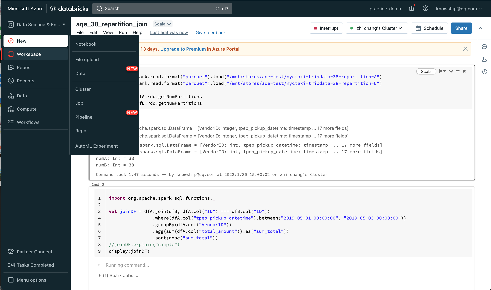

# 准备知识
- [DataBricks](https://databricks.com/)，基于Spark的Saas计算平台，存储是交给亚马孙云、谷歌云、微软云。
- [Azure](https://azure.microsoft.com/zh-cn/)，本次选用的存储平台

两个平台都有免费试用期，Azure集成了DataBricks产品，所以只需要注册Azure账号，选择Azure Databricks服务 **试用版(Premium - 14 天免费 DBU)** 


# 主要的概念
操作面板其实比较简洁实用，没有花里胡哨的东西。对用户而言，平台本身也就是一个开箱即用的Spark集群，我们只需要弄清楚三件事：
- 数据从哪里来
- 怎么表达计算
- 结果放到哪里去

## 1，数据从哪里来
一般有三个途径：DataBricks内置的测试集、本地上传到DBFS、云存储（azure/google/aws）

### DataBricks内置的测试集
参考这里：https://learn.microsoft.com/zh-cn/azure/databricks/dbfs/databricks-datasets

### 本地上传到DBFS
操作路径：New -> Add data -> DFBS -> Upload File

### 云存储（如Azure）
需要做两步操作：
1, 在Azure里创建存储账户、容器
2, 把容器挂载到DBFS(和linux里面mount类似)，代码如下
```
val storageAccountName = "存储账户"
val containerName = "容器"
val storageAccountAccessKey = ""

val url = "wasbs://" + containerName + "@" + storageAccountName + ".blob.core.windows.net"
val config = "fs.azure.account.key." + storageAccountName + ".blob.core.windows.net"

dbutils.fs.mount(
  source = url,
  mountPoint = "/mnt/whatever",
  extraConfigs = Map(config -> storageAccountAccessKey)
)
```

## 2，怎么表达计算
这里也有两步：首先创建计算集群，之后实现Spark操作

### 创建计算集群
在左侧`Compute`菜单里面，依次操作即可，因为和Azure打通了的，直接选择Azure里面的计算资源

### 实现Spark操作
一般就是用`Notebook`，一边写程序，一遍写注释（记录）；用起来非常简单，不用教就会。

## 3，结果放到哪里去
这个问题，可以用”你从哪里来，就到哪里去“来回答。**注意**：如果是存表的话，默认会放到DBFS的`/user/hive/warehouse/`下面

# 工具
- `dbutils`很有用， https://learn.microsoft.com/zh-cn/azure/databricks/dev-tools/databricks-utils
- `.dbc`文件是可以导出、导入的notebook归档，入口在`Wrokspace`里面的文件夹右上侧

# 实验
- [超大数据集中寻找缺失数字](./how-to-find-lost-number.md)