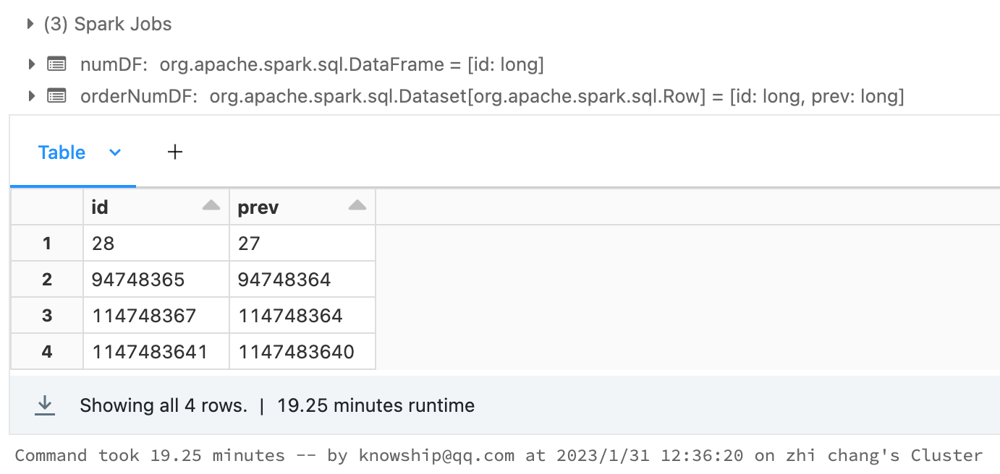
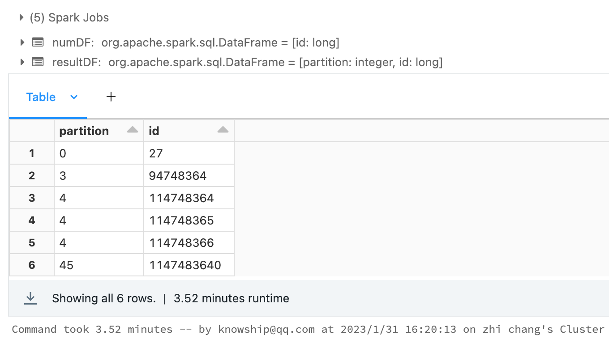
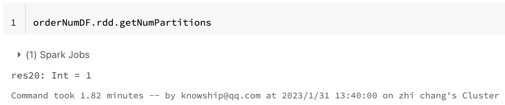

## 有这样一个问题
在一个整数区间(0 - Max)数据集里面，找出缺失的数字，例如数据集是（0，1，2，4，5），缺失的数字就是3。

### 具体条件
大约20000亿的数字，存储HDFS上，这些数字都是分布0~20000亿之间，各不相同，会有缺失的部分，需要基于Spark算缺失的部分。单个节点的资源和性能问题 （4G内存)

## 分析
这个问题的难点：需要保持状态。在分布式计算系统里面，保持状态是一个比较棘手的问题。

### 单机视角
如果是单机环境，我们会比较容易想到用`bit map`来维持状态，之后遍历找出没有标记的位，就是缺失的数字。如果有办法把这个思想转化到Spark集群里面，问题就解了。

### Spark视角
Spark里面对有状态的计算支持的比较好的有：UDAF和Window。理论上UDAF肯定能解这个问题，但本着能内置实现就不自定义的原则，Window是首选。在全局有序的情况下，只需要知道和前面一个数是不是有缝隙，可以计算出是否有缺失。window里面的lag就可以完成这个。

## 实现
使用`Azure DataBricks`平台来模拟一个约12亿的数据集，随机选取几个缺失的数字，作为实验数据集。

### 模拟的数据集
这里只是为了验证，缺失数字是随机选取的。
```
import org.apache.spark.sql.functions._

val df = spark.range(0, 1147483647, 1, 48)
              .toDF("id")
              .filter(
                col("id") =!= 94748364 && 
                col("id") =!= 114748364 && 
                col("id") =!= 114748365 &&
                col("id") =!= 114748366 &&
                col("id") =!= 27 &&
                col("id") =!= 1147483640
              )
df.write.format("parquet").save("/mnt/stores/lost_6_nums_range_1147483647")
```

### 方法一：使用Window
思想：排序后对比当前值和前面一个值
```
val numDF = spark.read.format("parquet").load("/mnt/stores/lost_6_nums_range_1147483647")

val numWindow = Window.orderBy("id")

val orderNumDF = numDF.withColumn("prev", lag("id", 1, -1).over(numWindow) + 1).filter(col("id") =!= col("prev"))

display(orderNumDF)
```


### 方法二：使用RDD + bitmap
思想：把数字按照range进行repartition，这样每个partition就相当于单机环境了。但DataFrame没有提供精确控制分区的API，所以需要用RDD来实现
- 第一步，实现Partitioner
```
object NumPartitioner extends Partitioner {
  
  val step: Long   =   25000000
  val maxNum: Long = 1147483647
  
  // 左闭右开区间 [0, step)
  override def getPartition(key: Any): Int = {
    val v = key.asInstanceOf[Long]
    
    assert(v < maxNum, s"too big, ${v} > ${maxNum}")
    (v / step).toInt
  }
  
  override def numPartitions: Int = (maxNum / step).toInt + 1
}
```
- 第二步，实现bitmap
```
class IntBitMap(max: Int) {
  
  assert(max > 0)
  
  // Int 4个字节，32位，所以每个Int可以表示32个数。
  private val buff = ArrayBuffer.fill[Int]( (max >>> 5) + 1 )(0)
  
  def add(num: Int): Unit = {
    assert(num >= 0 && num <= max)
    
    val range = num >>> 5
    val pos = num & 0x1f
    
    buff(range) = buff(range) | (1 << pos)
  }
  
  def contains(num: Int): Boolean = {
    assert(num >= 0 && num <= max)
    
    val range = num >>> 5
    val pos = num & 0x1f
    
    (buff(range) & (1 << pos)) != 0
  }
}
```
- 第三步，计算
```
val numDF = spark.read.format("parquet").load("/mnt/stores/lost_6_nums_range_1147483647")

val resultDF = numDF.rdd
                    .map(r => (r.getLong(0), true))
                    .partitionBy(NumPartitioner)
                    .mapPartitionsWithIndex { (idx, it) =>
                      
                      // 这个分区值域 [start, end)
                      val start = NumPartitioner.step * idx
                      //val end   = NumPartitioner.step * (idx + 1)

                      val bitFilter = new IntBitMap(NumPartitioner.step.toInt)
                      it.foreach(n => bitFilter.add( (n._1 - start).toInt ))

                       // 筛选没有出现的数字
                      (0 until NumPartitioner.step.toInt).filter(n => 
                                                        !bitFilter.contains(n) && (start + n) < NumPartitioner.maxNum
                                                      )
                                                      .map( n =>
                                                        (idx, start + n)
                                                      ).iterator
                    }.toDF("partition", "id")

display(resultDF)
```


## 结论
从上面直接结果耗时，明显看出问题：
- window + lag，用了19.25分钟
- RDD + bitmap，用了3.52分钟

### 原因分析
window性能会差很多，主要体现在两个方面：
- 需要排序，而RDD中只需要hash
- 全局的排序，导致整个计算过程退化成一个partition，一个window来维持状态，相当于串行

